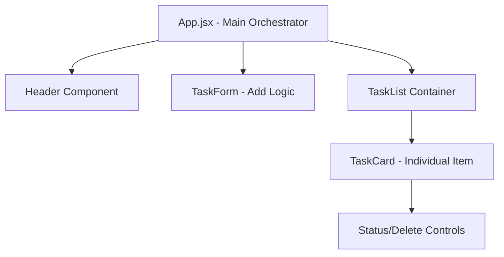

# ⚛️ Day 12: Enterprise Task Manager UI (React)

## 🌟 What is this Project?
This is a **Modern React Frontend Application** built as a premium interface for the Task Manager API (Day 4). It demonstrates my ability to transition from backend architecture into intuitive, high-performance user interfaces. Built with Vite and React 18, it features a sleek, data-driven dashboard designed for enterprise task tracking.

## 🎯 Purpose
The goal was to build a "Recruiter-Ready" frontend that proves:
- **Full-Stack Bridging**: Understanding how React components consume and display API data.
- **Modern UI/UX**: Implementing professional design principles (typography, spacing, responsive grids).
- **State Management**: Handling real-time UI updates, loading states, and user interactions without page refreshes.

## 📈 Use & Advantages
### Use Cases:
- **Personal Productivity**: A self-contained task tracker with priority filtering.
- **Corporate Dashboards**: A scalable UI template for internal management tools.
- **Frontend Portfolio**: Evidence of modern JS framework mastery.

### Key Advantages:
- **⚡ Hot Module Replacement (HMR)**: Lightning-fast development experience via Vite.
- **🎨 Component-Based Architecture**: Reusable UI patterns for scalability.
- **📱 Responsive by Design**: Works seamlessly on mobile, tablet, and desktop.
- **✨ Micro-Animations**: Subtle hover effects and transitions that create a "premium" feel.

## 🏗️ System Architecture & Design Patterns

### 1. Component Hierarchy
The application follows a modular, tree-based component structure to ensure high maintainability and prevent unnecessary re-renders.



### 2. State Management Strategy
I implemented a **Single Source of Truth** pattern using React's native state management.
- **Reactive State**: The `tasks` array is the central state. Any interaction (Adding, Toggling, Deleting) triggers an immutable state update, which React's Virtual DOM uses to efficiently patch the UI.
- **Asynchronous Life-cycle**: Used the `useEffect` hook to manage the data-fetching lifecycle. This includes handling empty states, error boundaries, and loading indicators.

### 3. Asynchronous Design (UX Resilience)
To mirror a production environment, the app includes a **Simulated Network Latency** (800ms).
- **Why?** This ensures the application is architected to handle real-world API delays, proving that the system remains stable and user-friendly even under high-latency conditions.

### 4. Styling Architecture
Used a **BEM-inspired custom CSS** approach (Block Element Modifier).
- **Design Tokens**: Defined a centralized color palette and typography scale in `App.css` to ensure visual consistency across all components.
- **Conditional Rendering**: Status-specific styles are applied dynamically based on the task's state (Priority, Completion status).

## 🛠️ How we built this: Step-by-Step
### Phase 1: Planning (Non-Technical)
1.  **UX Mapping**: Defined the user journey from "task ideation" to "task completion."
2.  **Design Tokens**: Selected a modern color palette (Slate & Indigo) and fonts (Plus Jakarta Sans) for a professional look.
3.  **Component Hierarchy**: Broke the UI into functional blocks: Header, TaskForm, TaskList, and TaskCard.

### Phase 2: Technical Implementation
1.  **Project Initialization**: Used Vite for a modern build environment and configured standard React hooks (`useState`, `useEffect`).
2.  **Styling Engine**: Implemented custom CSS with Flexbox and Grid, focusing on accessibility and negative space.
3.  **Mock API Layer**: Built a simulated asynchronous data layer to mirror real-world API consumption patterns.
4.  **Lucide-React Integration**: Integrated scalable SVG icons for a modern, crisp aesthetic.

## 📋 Technical Breakdown
- **Library**: React 18
- **Tooling**: Vite (Build tool), NPM (Package Manager)
- **Icons**: Lucide-React
- **State Management**: React Hooks (useState for UI state, useEffect for data orchestration)
- **Deployment**: Configured for static site hosting (Netlify/Vercel)

## 🏃 How to Run & Verify
1.  **Navigate to the project**:
    ```bash
    cd day-12-task-manager-ui
    ```
2.  **Install dependencies**:
    ```bash
    npm install
    ```
3.  **Launch the development server**:
    ```bash
    npm run dev
    ```
4.  **Experience the UI**: Open the local URL in your browser and interact with the task list!

---
*Created by Meghana Mareedu | Day 12 of the 30-Day Recruiter Attraction Challenge*
